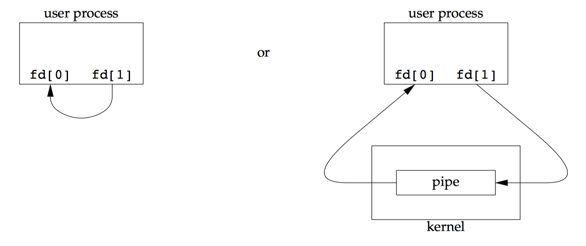
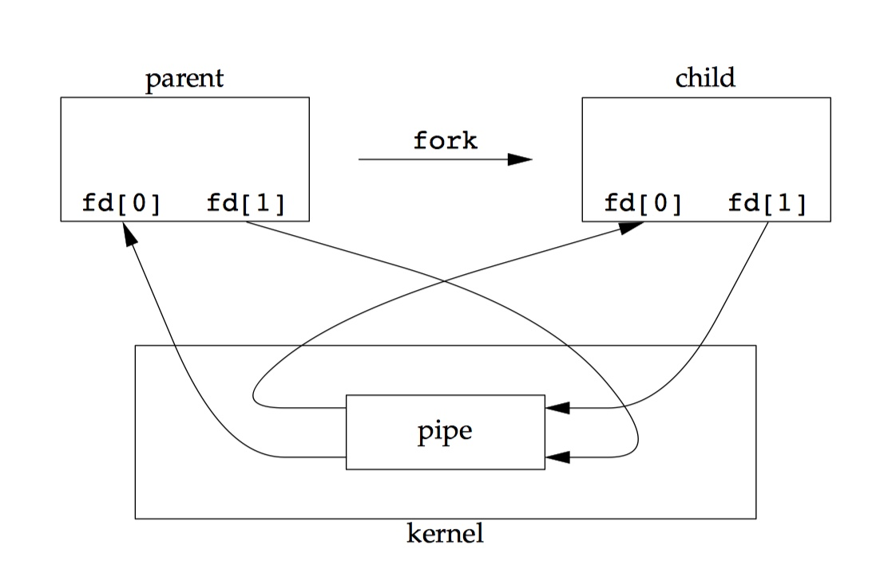

# Benchmark for two IPC methods: Pipes and Message Queue
This is a benchmark report on two IPC methods, pipes and message queue.
## A Brief Discussion
### Pipes
Pipes are the oldest form of UNIX System IPC and are provided by all UNIX systems.

It has two limitations. First of all, most of the UNIX system currently only support half-duplex pipes. Second, pipes can be used only between processes that have a common ancestor. Normally, a pipe is created by a process, that process calls `fork`, and the pipe is used between the parent and the child.

Despite the limitations, half-duplex pipes are still **the most commonly used form of IPC**.

A pipe is created by calling the `pipe` function.

```c
#include <unistd.h>

int pipe(int fd[2]);
```

The above code returns `0` if everything is fine, `-1` if there is an error.

Two file descriptor are returned through the `fd` argument. `fd[0]` is open for reading, and `fd[1]` id open for writing. The output of `fd[1]` is the input for `fd[0]`, as illustrated below.



A pipe in a single process is next to useless. Normally, the process that calls `pipe` then calls `fork`, creating an IPC channel from the parent to the child, or vice versa. The figure below shows the scenario.



If you just want the data flow through the pipe in one direction, just close the read end of the pipe of one process and the write end of the pipe of the other.

If we `read` from a pipe whose write end has been closed, `read` return `0` to indicate and end of file after all the data has been read. If `write` to a pipe whose read end has been closed, the signal `SIGPIPE` is generated. If we either ignore the signal or catch it and return from the signal handler, `write` return `-1` with `errno` set to `EPIPE`.

When we’re writing to a pipe, the constant `PIPE_BUF` specifies the kernel’s pipe buffer size. A `write` of `PIPE_BUF` bytes or less will not be interleaved with the `write` from other processes to the same pipe. But if multiple processes are writing to a pipe, and if we `write` more than `PIPE_BUF` bytes, the data might be interleaved with the data from the order writes. We can determine the value of `PIPE_BUF` by using `pathconf` or `fpathconf`.

### Message Queues
A message queue is a linked list of message stored within the kernel and identified by a message queue identifier.

A new queue is created or an existing queue opened by `msgget`. New messages are added to the end of a queue by `msgsnd`. Every message has a positive long integer type field, a non-negative length, and the actual data bytes, all of which are specified to `msgsnd` when the message is added to a queue. Messages are fetched from a queue by `msgrcv`. We don’t have to fetch the message in a first-in, first out order. Instead, we can fetch messages based on their type field.

Each queue has the following `msqid_ds` structure associated with it:

```c
struct msqid_ds {
	struct 		ipc_perm msg_perm;
	msgqnum_t 	msg_qnum;
	msglen_t 	msg_qbytes;
	pid_t 		msg_lspid;
	pid_t 		msg_lrpid;
	time_t 		msg_stime;
	time_t 		msg_rtime;
	time_t 		msg_ctime;
};
```

This structure defines the current status of the queue. The members shown are the ones defined by the Single UNIX Specification. Implementations include additional fields not covered by the standard.

The first function normally called is `msgget` to either open an existing queue or create a new queue.

```c
#include <sys/msg.h>

int msgget(key_t key, int flag);
```

The function shown above returns the non-negative message queue ID id everything is fine, `-1` if there is an error.

The `msgctl` function performs various operations on a queue.

```c
#include <sys/msg.h>

int msgctl(int msqid, int cmd, struct msqid_ds *buf );
```

Data is placed onto a message queue by calling `msgsnd`.

```c
#include <sys/msg.h>

int msgsnd(int msqid, const void *ptr, size_t nbytes, int flag);
```

### Differences
There are several differences between them.

1. Pipes aren’t limited in size while messages queues are.
2. Pipes can be integrated in system using file descriptors. Message queues have their own set of functions.
3. Pipes, once closed, require some amount of cooperation on both sides to reestablish them. Message queues can be closed and reopened on either side without the cooperation of the other side.
4. Pipes are flat, much like s stream, to impose a message structure you would have to implement a protocol on both sides. Message queues are message oriented already, no care has to be taken to get, say, the fifth message in the queue.

## Benchmark
We did some performance tests on Ubuntu 16.04 running in a VirtualBox 5.2.8 on my MacBook Pro (13-inch, 2017) with one 2.3 GHz Intel Core i5 processor and 2048 MB memory.

The test results are shown in `output/pipe.txt` and `output/msgq.txt`. For each test, the parent process creates the IPC structure and then forks a child process. After that, the parent process sends certain amount of data to child process chunked with `count` chunks.

The chunk size is chosen within `{16, 64, 128, 256, 1024, 2048}` and the number of chunks is chosen within `{1e3, 1e4, 1e5, 1e6}`. Thus the total amount of data range from 0.016 megabytes to 2048 megabytes.

## Result Analysis
It looks like when data size is small, `pipe` is a little bit faster than `msgq`. When the size goes up, `pipe` is no better than `msgq`. This is not surprising because `pipe` is the original method of IPC on Unix, so implementors have had plenty of time to optimize it. What's more, other benefits of pipes cause it to be a common method of IPC on Unix, which gives implementors still more motivation to optimize pipes.

It always faster for both methods to  send message with a bigger chunk size for the same amount of total data size. In other words, larger buffer size means higher throughput.